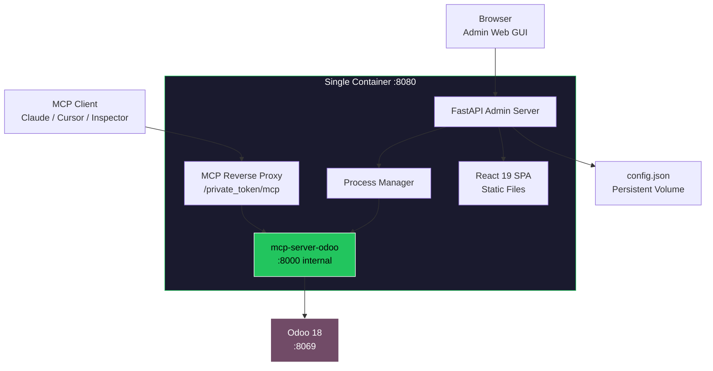

<p align="center">
  
</p>

<h1 align="center">ivnvxd MCP Admin</h1>

<p align="center">
  <strong>Production-Ready Admin Bundle for ivnvxd/mcp-server-odoo</strong><br/>
  Web GUI + Built-in MCP Reverse Proxy + Process Manager, all in one container.
</p>

<p align="center">
  <a href="#features">Features</a> &bull;
  <a href="#architecture">Architecture</a> &bull;
  <a href="#screenshots">Screenshots</a> &bull;
  <a href="#quick-start">Quick Start</a> &bull;
  <a href="#deployment">Deployment</a> &bull;
  <a href="#configuration">Configuration</a> &bull;
  <a href="#api-reference">API Reference</a> &bull;
  <a href="README_zh-TW.md">中文文件</a>
</p>

<p align="center">
  
  
  
  
  
  
  
</p>

---

## Overview

**ivnvxd MCP Admin** is an all-in-one management platform that wraps [ivnvxd/mcp-server-odoo](https://github.com/ivnvxd/mcp-server-odoo) with a full-featured Web GUI, a built-in MCP reverse proxy (replacing nginx), and an async process manager -- all bundled into a single container.

It allows you to manage your MCP server entirely through a browser, with no `kubectl` or YAML editing required.

<p align="center">
  
</p>

### Why This Package?

| Challenge | Solution |
|-----------|----------|
| Managing MCP server requires `kubectl` + YAML editing | **Web GUI** with 8 management pages |
| Token rotation requires manual Secret update + pod restart | **One-click token rotation** with confirmation dialog |
| No visibility into MCP server logs without `kubectl logs` | **Real-time SSE log streaming** in browser |
| Needs separate nginx sidecar for auth proxy | **Built-in Python reverse proxy** (zero nginx) |
| No dashboard for health monitoring | **Live dashboard** with MCP/Odoo/Proxy status cards |
| Tool management requires env var changes + restart | **Visual toggle switch** to enable/disable all tools |
| Odoo connection config scattered across Secrets/ConfigMaps | **Single settings form** with test connection button |

---

## Features

### Web GUI (React 19 SPA)
- **8 management pages**: Dashboard, Tools, Connection, Tokens, Logs, Permissions, Settings, Login
- **JWT authentication** with httponly cookie support
- **Dark theme** with responsive design
- **30-second auto-refresh** dashboard

### Built-in MCP Reverse Proxy
- **Replaces nginx entirely** -- no sidecar container needed
- **URL-path token authentication**: `/private_{token}/mcp`
- **SSE streaming support** with `x-accel-buffering: no`
- **86,400-second timeout** for long-running MCP tool calls
- Compatible with **Claude Desktop**, **Cursor**, **Claude Code CLI**, **MCP Inspector**

### Process Manager
- **Async subprocess management** of `mcp-server-odoo`
- **Start/stop/restart** via GUI or API
- **Stdout/stderr capture** into ring buffer for log streaming
- **PID tracking** and restart counter

### MCP Server (ivnvxd/mcp-server-odoo v0.7.1)
- **9 MCP tools**: search_records, get_record, list_models, aggregate_records, list_resource_templates, create_record, update_record, delete_record, post_message
- **Smart field selection** -- automatically picks common fields
- **YOLO mode** (read/full) for quick testing without Odoo module
- **Standard mode** with mcp_server module for production (whitelist + API key + audit)
- **Native `/health` endpoint** for monitoring

---

## Architecture

```
Browser (React 19 SPA)
        |
        v
+------ FastAPI Admin Server (:8080) ------+
|                                           |
|  /api/*          JWT-protected admin API  |
|    /api/health     Dashboard data         |
|    /api/config     Connection config      |
|    /api/tools      Tool enable/disable    |
|    /api/tokens     Token rotation         |
|    /api/logs       SSE log streaming      |
|    /api/settings   MCP server settings    |
|                                           |
|  /private_{token}/*  MCP Reverse Proxy    |
|    -> http://127.0.0.1:8000/mcp           |
|                                           |
|  /*              SPA static files         |
|                                           |
|  ProcessManager (asyncio subprocess)      |
|    -> mcp-server-odoo :8000               |
|                                           |
+-------------------------------------------+
        |
        | XML-RPC (/xmlrpc/2/* or /mcp/xmlrpc/*)
        v
   Odoo 18 (:8069)
```

### System Flow



### Component Architecture

```mermaid
graph LR
    subgraph Core["mcp_admin_core (reusable)"]
        App[app.py<br/>FastAPI Factory]
        ProxyM[proxy.py<br/>Reverse Proxy]
        Process[process.py<br/>Subprocess Mgr]
        Auth[auth/<br/>JWT Middleware]
        ConfigS[config/<br/>File Store]
    end

    subgraph Target["ivnvxd_mcp_admin (target-specific)"]
        Main[main.py<br/>Entry Point]
        Tools[tool_registry.py<br/>9 Tools]
        Health[routers/health.py<br/>ivnvxd /health]
        ConnCfg[routers/config.py<br/>ODOO_USER + API_KEY]
    end

    Main --> App
    Main --> Health
    Main --> ConnCfg
    Main --> Tools

    style Core fill:#1e3a5f,stroke:#60a5fa
    style Target fill:#3a1e5f,stroke:#a78bfa
```



---

## Screenshots

### Login

Secure JWT-based authentication with admin password.

<p align="center">
  
</p>

### Dashboard

Real-time health monitoring with 6 status cards: MCP Server, Odoo Instance, MCP Proxy, Version, Database, and Module count. Auto-refreshes every 30 seconds.

<p align="center">
  
</p>

### Tool Manager

Master toggle switch to enable/disable all 9 MCP tools at once. Tools are categorized into Read & Discover (5) and Write & Operate (4, marked as dangerous).

<p align="center">
  
</p>

### Connection Configuration

Configure Odoo connection with support for three operation modes: Standard (API key + mcp_server module), YOLO Read-Only, and YOLO Full Access. Includes one-click connection test.

<p align="center">
  
</p>

### Token Manager

Manage MCP proxy authentication tokens. Show/hide masked tokens, copy to clipboard, and rotate with confirmation dialog. Rotation history tracks the last 10 events.

<p align="center">
  
</p>

### Log Viewer

Real-time MCP server log streaming via Server-Sent Events. Supports pause/resume, auto-scroll, text filtering, and maintains a 5,000-line ring buffer.

<p align="center">
  
</p>

### Settings

Full MCP server process configuration: command, arguments, port, environment variables. Includes restart button with live PID and restart count feedback. Also configures proxy timeout and admin password.

<p align="center">
  
</p>

### Permission Editor

JSON-based permission policy editor with syntax validation, format, and reset capabilities.

<p align="center">
  
</p>

---

## Quick Start

### Docker

```bash
docker run -d --name ivnvxd-mcp-admin \
  -p 8080:8080 \
  -e ODOO_URL=http://your-odoo:8069 \
  -e ODOO_DB=your_db \
  -e ODOO_USER=admin \
  -e ODOO_API_KEY=your_api_key \
  -v mcp-admin-data:/data \
  ghcr.io/woowtech/ivnvxd-mcp-admin:latest
```

Then open `http://localhost:8080` and login with password `admin`.

### Docker Compose

```bash
git clone https://github.com/WOOWTECH/woow_odoo_manage_mcp_server.git
cd woow_odoo_manage_mcp_server
ODOO_API_KEY=your_key docker compose up -d
```

---

## Deployment

### Kubernetes / K3s (Helm)

The chart lives in `charts/odoo-manage-mcp/`. One release per Odoo instance, each
in its own namespace. It replaces the former `k8s/08-mcp-odoo-ivnvxd-admin.yaml`
and renders the same objects field for field, with the credentials moved out of
the repository and into a Kubernetes Secret.

#### 1. Create the Secret

Copy `charts/odoo-manage-mcp/examples/secrets.example.yaml` **outside** the repo,
replace every `REPLACE_ME`, then apply the copy:

```bash
kubectl apply -f /secure/path/secrets.yaml
```

Keys: `odoo-api-key` (required), `admin-password` (used with
`seedConfig.enabled=true`), `jwt-secret` (used with `seedConfig.jwtSecret=true`).
The chart only references this Secret; `secrets.create=false` is the default, so
`helm upgrade` can never overwrite a rotated key.

#### 2. Create the image pull Secret

```bash
kubectl create secret docker-registry ghcr-creds \
  --docker-server=ghcr.io \
  --docker-username=YOUR_GITHUB_USER \
  --docker-password=YOUR_GITHUB_TOKEN \
  -n your-odoo-ns
```

Both Secrets must be in the **same namespace as the release** — the mismatch in
the old instructions (`-n your-odoo-ns` against a manifest hardcoded to another
namespace) was what produced `ImagePullBackOff`.

#### 3. Install

From a clone:

```bash
git clone https://github.com/WOOWTECH/woow_odoo_manage_mcp_server.git
cd woow_odoo_manage_mcp_server

helm install mcp-odoo-admin charts/odoo-manage-mcp \
  -n your-odoo-ns --create-namespace \
  --set instance.partOf=your-instance \
  --set odoo.url=http://your-odoo-svc:8069 \
  --set persistence.storageClassName=longhorn-delete
```

From the GitHub tarball (the chart is in a subdirectory, so extract first):

```bash
curl -sL https://github.com/WOOWTECH/woow_odoo_manage_mcp_server/archive/refs/heads/main.tar.gz | tar xz

helm install mcp-odoo-admin \
  woow_odoo_manage_mcp_server-main/charts/odoo-manage-mcp \
  -n your-odoo-ns --create-namespace \
  --set instance.partOf=your-instance \
  --set odoo.url=http://your-odoo-svc:8069
```

An instance file is cleaner than a pile of `--set`; see
`charts/odoo-manage-mcp/examples/values.lyucijyun-odoo.yaml`.

#### 4. Verify

```bash
kubectl -n your-odoo-ns rollout status deploy/mcp-odoo-ivnvxd-admin --timeout=10m
helm test mcp-odoo-admin -n your-odoo-ns --logs
```

The smoke pod is read-only: `/healthz`, the admin SPA, a rejected bad login, and
(with `seedConfig.enabled=true`) a successful login with the password from the
Secret.

#### 5. Uninstall — data is kept

```bash
helm uninstall mcp-odoo-admin -n your-odoo-ns
```

`keepOnUninstall: true` (the default) puts `helm.sh/resource-policy: keep` on the
PVC, the Namespace and any chart-created Secret, so `/data/config.json` — the
admin password, the MCP token, the tool toggles and the token history — survives.
Deleting it is a deliberate `kubectl delete pvc mcp-odoo-ivnvxd-admin-data`.

#### Key values

| Value | Default | Notes |
|-------|---------|-------|
| `instance.partOf` | *(required)* | Instance slug, used as `app.kubernetes.io/part-of` |
| `odoo.url` | *(required)* | In-cluster Odoo URL, e.g. `http://acme-odoo-svc:8069` |
| `odoo.db` / `odoo.user` | `odoo` / `admin` | Passed to the `mcp-server-odoo` subprocess |
| `secrets.create` | `false` | `true` renders the Secret from values (fresh installs, tests) |
| `secrets.name` | `mcp-odoo-ivnvxd-admin-secrets` | Existing Secret with `odoo-api-key`, `admin-password` |
| `keepOnUninstall` | `true` | `helm.sh/resource-policy: keep` on the PVC, Namespace, Secret |
| `persistence.storageClassName` | `""` (cluster default) | **Set explicitly on woow-k3s**: it has two default classes |
| `image.repository` / `tag` | `ghcr.io/woowtech/ivnvxd-mcp-admin` / `latest` | Private; needs `image.pullSecrets` |
| `seedConfig.enabled` | `false` | Seed `admin-password` from the Secret on first boot (see below) |
| `seedConfig.jwtSecret` | `false` | Seed `JWT_SECRET`, so logins survive a pod restart |
| `buildFromSource.enabled` | `false` | Build this repo at pod start instead of pulling the image |
| `nodeSelector` | control-plane | Set to `{}` to let the scheduler choose |
| `tests.enabled` | `true` | Render the `helm test` smoke pod |

#### The admin password, and `seedConfig`

The application never reads `ADMIN_PASSWORD` (`mcp_admin_core/auth/middleware.py`
reads only `JWT_SECRET` and `JWT_EXPIRY_HOURS`). On a fresh volume the GUI
password is therefore the built-in default `admin` from
`mcp_admin_core/config/store.py`, whatever the Secret says. Two ways out:

- change it on the Settings page immediately after the first login, or
- install with `--set seedConfig.enabled=true`: an init container writes
  `admin-password` from the Secret into `/data/config.json` with `setdefault`, so
  it seeds the **first** boot only and never reverts a password you change later
  in the GUI.

`seedConfig` is off by default because it adds an init container, i.e. it changes
the pod template.

#### Installing without registry credentials

`--set buildFromSource.enabled=true` (or
`-f charts/odoo-manage-mcp/examples/values.build-from-source.yaml`) skips the
private image: init containers clone this repository and build the SPA, and the
main container runs `pip install mcp-server-odoo .` before `uvicorn` — the same
runtime model the `Woow_k3s_litellm` MCP console uses. Only public images are
pulled. This is how the chart's acceptance test runs.

#### Taking over an instance already deployed with `kubectl apply`

The chart renders the legacy objects field for field, so the pod template is
unchanged and an adoption restarts nothing:

```bash
# 1. Confirm no drift first
scripts/check-render.sh

# 2. Adopt the existing objects
helm upgrade --install mcp-odoo-admin charts/odoo-manage-mcp \
  -n your-odoo-ns --take-ownership \
  -f charts/odoo-manage-mcp/examples/values.lyucijyun-odoo.yaml
```

Keep `secrets.create=false` so the existing Secret is left untouched, and do not
enable `seedConfig` or `containerSecurityContext` during the takeover: both
change the pod template and would roll the pod.

#### Follow-ups (not changed in this migration)

- **Rotate the credentials.** The Odoo API key and the admin password were
  committed in plaintext in `k8s/08-mcp-odoo-ivnvxd-admin.yaml` from 2026-07-09.
  They are gone from `HEAD` but remain in the git history of this public
  repository. Rotate the Odoo API key and the GUI password.
- `image: latest` + `imagePullPolicy: Always`, and `pip install mcp-server-odoo`
  is unpinned in the `Dockerfile`: a restart can silently change behaviour.
- The container runs as root (no `USER` in the `Dockerfile`), so
  `containerSecurityContext` stays empty; hardening it needs an image rebuild.
- `/healthz` reports only the FastAPI app, not the `mcp-server-odoo` subprocess:
  the proxy can return 502 while all three probes stay green.
- No NetworkPolicy ships with the chart.


### Cloudflare Tunnel

After deploying, add a tunnel route:

| Field | Value |
|-------|-------|
| Hostname | `your-mcp-admin.example.com` |
| Service | `http://mcp-odoo-ivnvxd-admin-svc:8080` |

MCP proxy URL: `https://your-mcp-admin.example.com/private_{token}/mcp`

---

## Configuration

### Environment Variables

| Variable | Default | Description |
|----------|---------|-------------|
| `MCP_ADMIN_CONFIG` | `/data/config.json` | Path to persistent config file |
| `JWT_SECRET` | (auto-generated) | JWT signing secret |
| `JWT_EXPIRY_HOURS` | `24` | JWT token expiry |
| `ODOO_URL` | -- | Initial Odoo URL |
| `ODOO_DB` | -- | Initial database name |
| `ODOO_USER` | -- | Initial Odoo username |
| `ODOO_API_KEY` | -- | Initial API key (Standard mode) |
| `ODOO_PASSWORD` | -- | Initial password (YOLO mode) |

### Operation Modes

| Mode | `ODOO_YOLO` | Requires Module | Auth | Access |
|------|-------------|-----------------|------|--------|
| **Standard** | `off` | Yes (`mcp_server` v18.0.1.1.0) | API key | Whitelist only |
| **YOLO Read** | `read` | No | Password | All models, read-only |
| **YOLO Full** | `true` | No | Password | All models, full CRUD |

---

## API Reference

### Admin Endpoints

| Method | Path | Description |
|--------|------|-------------|
| `POST` | `/api/auth/login` | Get JWT token |
| `GET` | `/api/health` | Dashboard health data |
| `GET` | `/api/config` | Connection config (masked) |
| `PUT` | `/api/config/connection` | Update connection |
| `POST` | `/api/config/test` | Test Odoo connectivity |
| `GET` | `/api/tools` | List 9 tools with status |
| `PUT` | `/api/tools` | Enable/disable tools |
| `GET` | `/api/tokens` | Current token (masked) + history |
| `POST` | `/api/tokens/rotate` | Generate new token |
| `GET` | `/api/logs/stream` | SSE log stream |
| `GET` | `/api/logs/search?q=error` | Search log buffer |
| `PUT` | `/api/settings/{section}` | Update config section |
| `POST` | `/api/settings/mcp/restart` | Restart MCP server |

### MCP Proxy

```bash
# MCP clients connect via token-authenticated proxy
curl -X POST https://your-admin.example.com/private_{TOKEN}/mcp \
  -H "Content-Type: application/json" \
  -H "Accept: application/json, text/event-stream" \
  -d '{"jsonrpc":"2.0","method":"initialize","params":{...},"id":1}'
```

---

## Project Structure

```
woow_odoo_manage_mcp_server/
  mcp_admin_core/                 # Reusable core framework
    app.py                        # FastAPI factory + lifespan
    proxy.py                      # Built-in MCP reverse proxy
    process.py                    # Async subprocess manager
    config/store.py               # File-backed config store
    auth/middleware.py             # JWT authentication
    routers/settings.py           # Settings CRUD API
    k8s/client.py                 # Optional K8s API wrapper
  ivnvxd_mcp_admin/               # ivnvxd-specific package
    main.py                       # Entry point
    tool_registry.py              # 9 tool definitions
    routers/
      config.py                   # Odoo connection config
      health.py                   # Dashboard + /health check
      tools.py                    # Tool management
      tokens.py                   # Token rotation
      logs.py                     # SSE log streaming
  frontend/                       # React 19 + Tailwind 4 + Vite 6
    src/pages/                    # 8 page components
    src/components/               # Sidebar, StatusCard
  charts/odoo-manage-mcp/         # Helm chart (replaces the old k8s/ manifest)
    values.yaml                   # Every knob, with the deployed defaults
    templates/                    # PVC, Deployment, Service, Secret, helm test
    examples/                     # secrets.example.yaml + instance values
  tests/golden/                   # Expected render, diffed by scripts/check-render.sh
  scripts/                        # check-render.sh, check-drift.sh
  Dockerfile                      # Multi-stage build
  docker-compose.yml              # Local development
  pyproject.toml                  # Python package config
```

---

## Tech Stack

| Layer | Technology |
|-------|-----------|
| **Frontend** | React 19, Tailwind CSS 4, Vite 6, TanStack React Query 5, lucide-react |
| **Backend** | FastAPI, Uvicorn, httpx, PyJWT |
| **MCP Server** | ivnvxd/mcp-server-odoo v0.7.1 |
| **Build** | Multi-stage Docker (Node 20 + Python 3.12) |
| **Deployment** | K3s, Cloudflare Tunnel, PVC |

---

## Use Case & Permission Model

### Recommended Use: Admin Management Console

This bundle is designed as a **management-level console** for Odoo administrators. It ships with `ODOO_YOLO=true` and `call_model_method` enabled by default, giving full access to all Odoo models and workflow actions (confirm orders, post invoices, validate transfers, etc.).

> **This bundle should only be used by administrators or accounts with full Odoo access.** It is not designed for distribution to general users with limited permissions.

### Why Admin-Only?

The default configuration runs in **YOLO Full Access mode**, which means:

- All Odoo models are accessible (not just whitelisted ones)
- All CRUD operations are enabled
- `call_model_method` allows executing **any** Odoo workflow action (`action_confirm`, `action_post`, `button_validate`, etc.)
- No Odoo module or whitelist is required

This is extremely powerful for administration, but **should not be given to users who should not have full access**.

### Permission Architecture

```
Admin GUI login (single password)
    ↓
MCP Proxy Token (single shared token)
    ↓
Odoo connection (single account, typically admin)
    ↓
YOLO=true → all models, all methods
```

Odoo's ACL system still applies to the connected account. If you connect with a limited Odoo user, that user's permissions will be enforced. However, the intended use is with an admin account for full management capability.

### What This Bundle Can Do (that others can't)

With `call_model_method` + YOLO mode, this is the only bundle that can:

| Action | MCP Tool Call |
|--------|--------------|
| Confirm a sale order | `call_model_method(model="sale.order", method="action_confirm", arguments=[[order_id]])` |
| Post an invoice | `call_model_method(model="account.move", method="action_post", arguments=[[invoice_id]])` |
| Validate a transfer | `call_model_method(model="stock.picking", method="button_validate", arguments=[[picking_id]])` |
| Approve a leave | `call_model_method(model="hr.leave", method="action_approve", arguments=[[leave_id]])` |
| Mark lead as won | `call_model_method(model="crm.lead", method="action_set_won", arguments=[[lead_id]])` |
| Cancel any document | `call_model_method(model="...", method="action_cancel", arguments=[[id]])` |

### Comparison with Woow Odoo MCP Server

| Aspect | [Woow Odoo MCP Server](https://github.com/WOOWTECH/woow_odoo_mcp_server) (A款) | **This Bundle (B款)** |
|--------|-------------------|-------------------|
| **Best for** | Multi-user application server | **Admin management console** |
| **Permission model** | Odoo account ACL (per-user) | YOLO=true (full access, admin only) |
| **Tools** | 39 tools with per-tool toggle | **10 tools with master toggle** |
| **Workflow actions** | Via `execute_method` | Via `call_model_method` |
| **Write safety** | 3-step approval | **Direct CRUD** |
| **Smart fields** | No | **Yes (auto-selects common fields)** |
| **Response quality** | Bare IDs for writes | **Rich: record + URL + confirmation message** |
| **Connection auth** | Username + Password | **API Key or Password + YOLO mode selector** |
| **Default mode** | Needs manual config | **Ready out of the box (YOLO=true)** |

### Recommended Setup: Use Both

| Role | Bundle | Odoo Account |
|------|--------|-------------|
| **Administrators** | This bundle (B款) — YOLO full access, workflow actions | admin |
| **Sales team** | [A款](https://github.com/WOOWTECH/woow_odoo_mcp_server) — 39 tools, per-tool control | sales_user (limited) |
| **Accountants** | [A款](https://github.com/WOOWTECH/woow_odoo_mcp_server) — read-only tools enabled | accountant (limited) |
| **Read-only viewers** | [A款](https://github.com/WOOWTECH/woow_odoo_mcp_server) — only Read & Discover tools | viewer (minimal) |

---

## Comparison

| Feature | ivnvxd + nginx sidecar | **ivnvxd MCP Admin** |
|---------|----------------------|---------------------|
| Containers | 2 (ivnvxd + nginx) | **1 (all-in-one)** |
| Management | kubectl + YAML | **Web GUI** |
| Token rotation | Manual Secret + restart | **One-click in GUI** |
| Tool management | All-or-nothing | **Master toggle** |
| Logs | `kubectl logs` | **Real-time SSE** |
| Monitoring | curl /health | **Dashboard** |
| Settings | Edit ConfigMap | **Web form** |
| Auth proxy | nginx ConfigMap | **Built-in proxy** |

---

## License

[MIT](LICENSE)

---

<p align="center">
  <sub>Built with &#10084; by <a href="https://github.com/WOOWTECH">WOOWTECH</a> &bull; Powered by <a href="https://github.com/ivnvxd/mcp-server-odoo">ivnvxd/mcp-server-odoo</a></sub>
</p>
