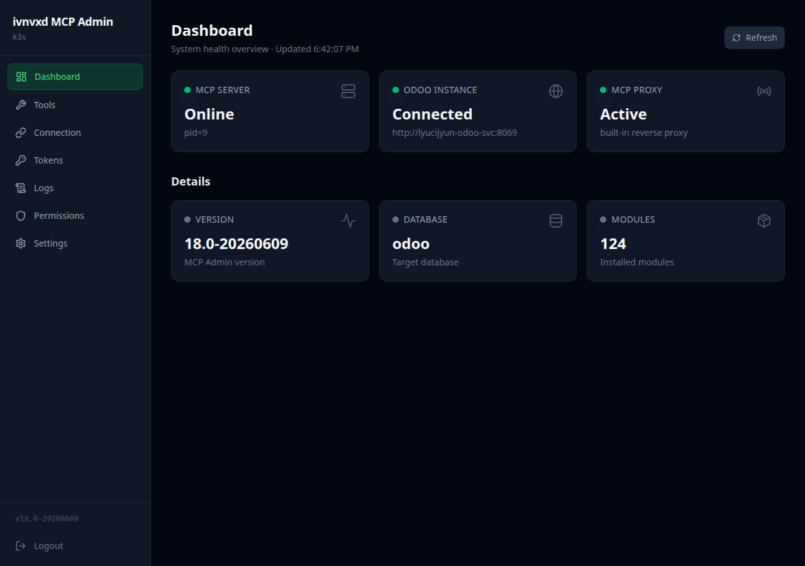
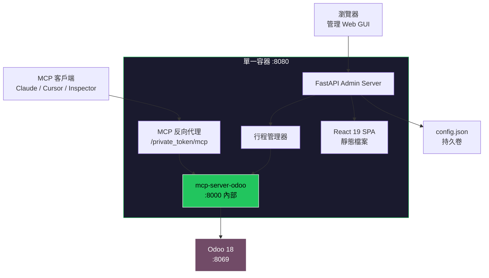
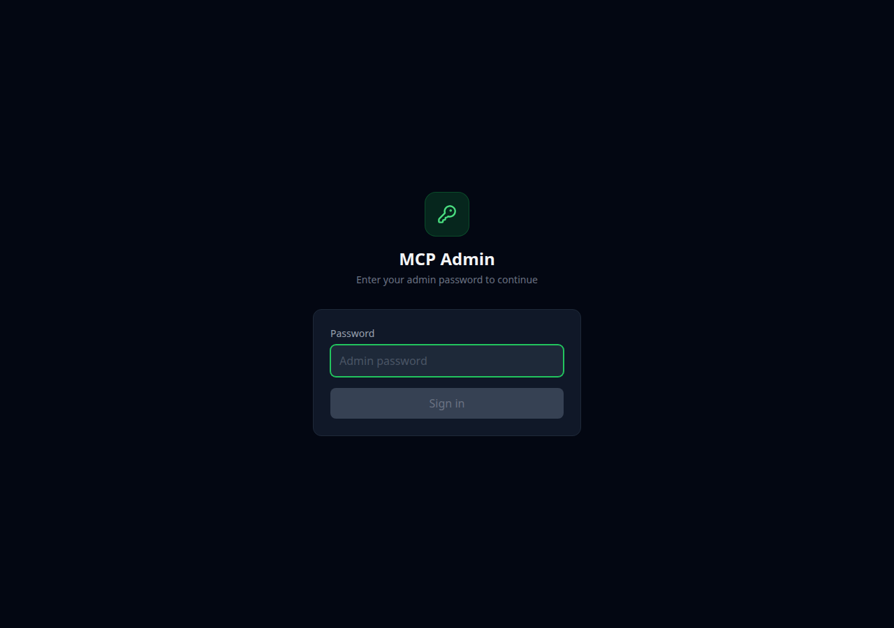
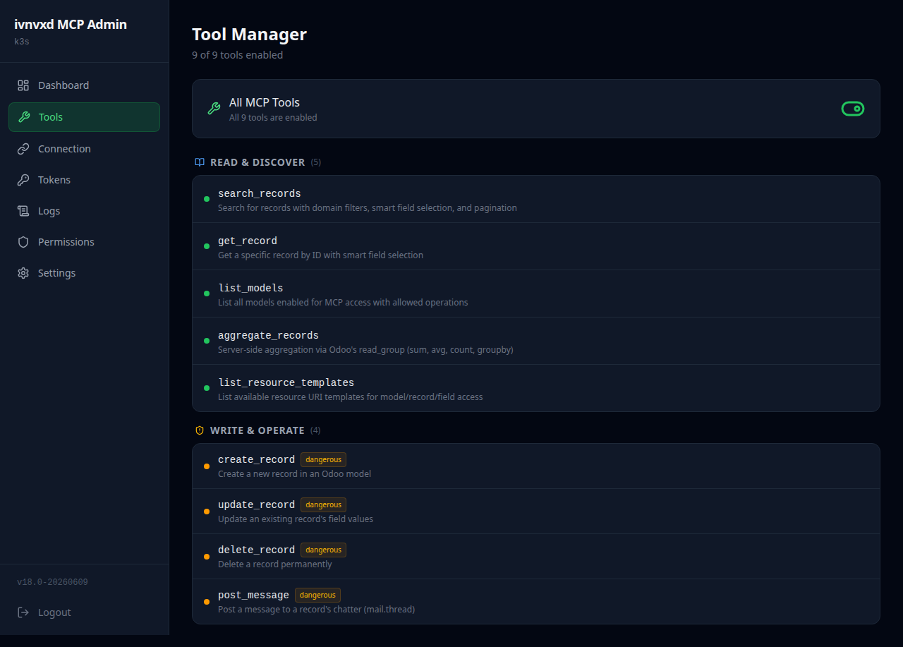
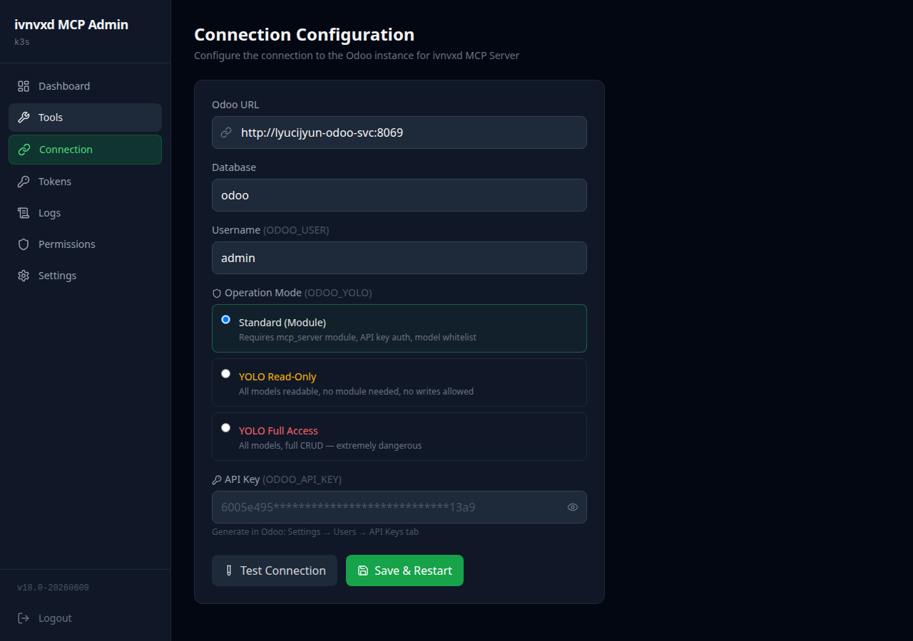
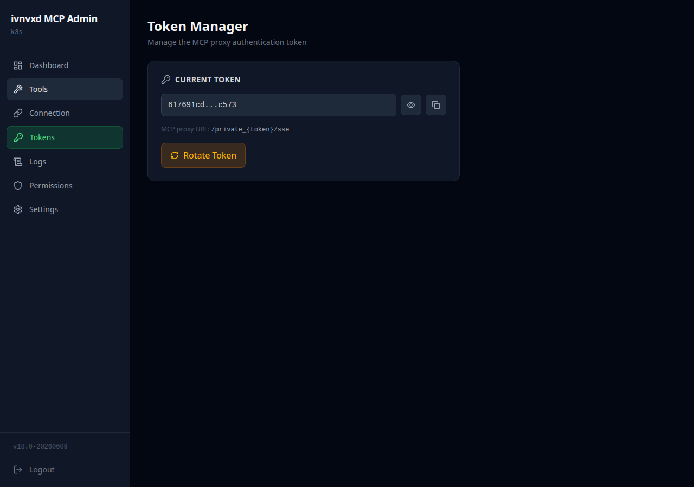
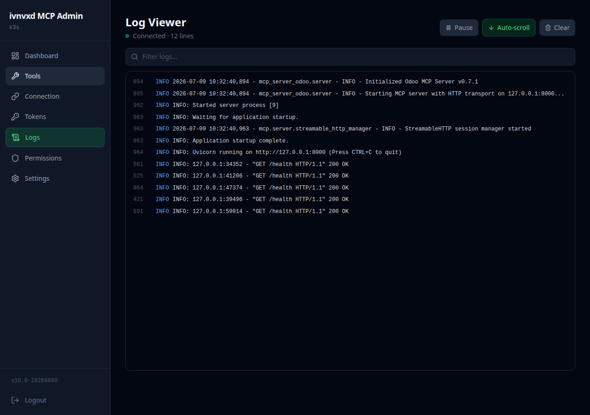
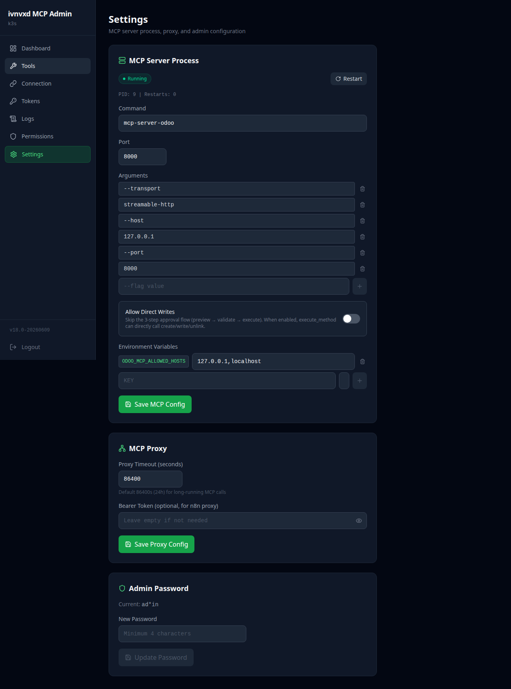
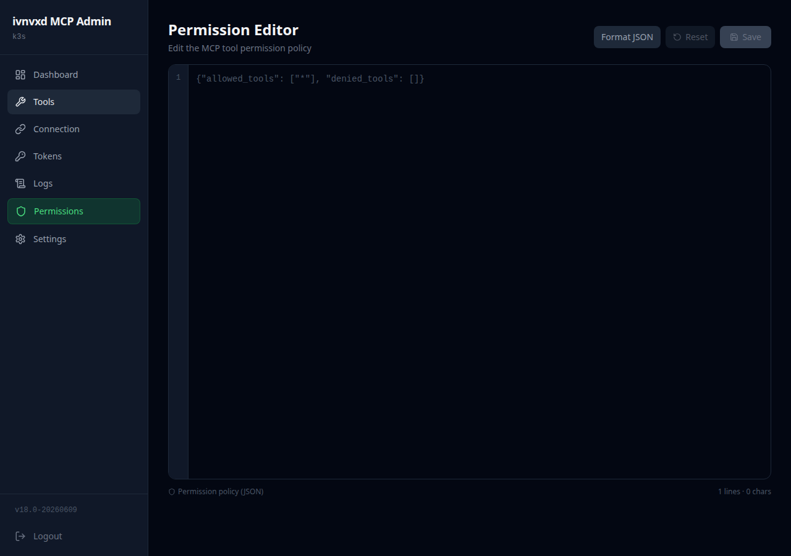

<p align="center">
  
</p>

<h1 align="center">ivnvxd MCP Admin</h1>

<p align="center">
  <strong>適用於 ivnvxd/mcp-server-odoo 的生產級管理套件</strong><br/>
  Web GUI + 內建 MCP 反向代理 + 行程管理器，全部打包在單一容器中。
</p>

<p align="center">
  <a href="#功能特色">功能特色</a> &bull;
  <a href="#系統架構">系統架構</a> &bull;
  <a href="#畫面截圖">畫面截圖</a> &bull;
  <a href="#快速開始">快速開始</a> &bull;
  <a href="#部署方式">部署方式</a> &bull;
  <a href="#設定說明">設定說明</a> &bull;
  <a href="#api-參考">API 參考</a> &bull;
  <a href="README.md">English</a>
</p>

<p align="center">
  
  
  
  
  
  
  
</p>

---

## 概覽

**ivnvxd MCP Admin** 是一個一站式管理平台，將 [ivnvxd/mcp-server-odoo](https://github.com/ivnvxd/mcp-server-odoo) 包裝成完整的 Web GUI、內建 MCP 反向代理（取代 nginx），以及非同步行程管理器 — 全部打包在單一容器中。

透過瀏覽器即可管理整個 MCP Server，完全不需要 `kubectl` 或手動編輯 YAML。

<p align="center">
  
</p>

### 為什麼需要這個套件？

| 挑戰 | 解決方案 |
|------|----------|
| 管理 MCP 需要 `kubectl` + 編輯 YAML | **Web GUI** 8 個管理頁面 |
| Token 輪換需要手動改 Secret + 重啟 Pod | **一鍵 Token 輪換** 含確認對話框 |
| 看日誌需要 `kubectl logs` | **瀏覽器即時 SSE 日誌串流** |
| 需要額外的 nginx sidecar 做認證代理 | **內建 Python 反向代理**（零 nginx） |
| 沒有健康監控儀表板 | **即時儀表板** 含 MCP/Odoo/Proxy 狀態卡 |
| 工具管理需要改環境變數 + 重啟 | **視覺化總開關** 一鍵啟用/停用所有工具 |
| Odoo 連線設定散落在 Secrets/ConfigMaps | **統一設定表單** 含連線測試按鈕 |

---

## 功能特色

### Web GUI（React 19 SPA）
- **8 個管理頁面**：儀表板、工具、連線設定、Token、日誌、權限、設定、登入
- **JWT 認證**，支援 httponly cookie
- **深色主題**，響應式設計
- **30 秒自動重新整理**儀表板

### 內建 MCP 反向代理
- **完全取代 nginx** — 不需要 sidecar 容器
- **URL 路徑 Token 認證**：`/private_{token}/mcp`
- **SSE 串流支援**，`x-accel-buffering: no`
- **86,400 秒逾時**，適合長時間 MCP 工具呼叫
- 相容 **Claude Desktop**、**Cursor**、**Claude Code CLI**、**MCP Inspector**

### 行程管理器
- `mcp-server-odoo` 的**非同步子行程管理**
- 透過 GUI 或 API 執行**啟動/停止/重啟**
- **Stdout/stderr 擷取**到環形緩衝區供日誌串流
- **PID 追蹤**和重啟計數器

### MCP Server（ivnvxd/mcp-server-odoo v0.7.1）
- **9 個 MCP 工具**：search_records、get_record、list_models、aggregate_records、list_resource_templates、create_record、update_record、delete_record、post_message
- **智慧欄位選擇** — 自動挑選常用欄位
- **YOLO 模式**（read/full）快速測試，免安裝 Odoo 模組
- **標準模式**搭配 mcp_server 模組用於正式環境（白名單 + API key + 稽核）
- **原生 `/health` 端點**供監控使用

---

## 系統架構

```
瀏覽器（React 19 SPA）
        |
        v
+------ FastAPI Admin Server (:8080) ------+
|                                           |
|  /api/*          JWT 保護的管理 API        |
|    /api/health     儀表板資料              |
|    /api/config     連線設定                |
|    /api/tools      工具啟用/停用           |
|    /api/tokens     Token 輪換              |
|    /api/logs       SSE 日誌串流            |
|    /api/settings   MCP 伺服器設定          |
|                                           |
|  /private_{token}/*  MCP 反向代理          |
|    -> http://127.0.0.1:8000/mcp           |
|                                           |
|  /*              SPA 靜態檔案              |
|                                           |
|  ProcessManager（asyncio 子行程）          |
|    -> mcp-server-odoo :8000               |
|                                           |
+-------------------------------------------+
        |
        | XML-RPC
        v
   Odoo 18 (:8069)
```

### 系統流程圖



---

## 畫面截圖

### 登入頁面

安全的 JWT 認證，使用管理員密碼登入。

<p align="center">
  
</p>

### 儀表板

即時健康監控，包含 6 張狀態卡：MCP Server、Odoo 實例、MCP Proxy、版本、資料庫、模組數量。每 30 秒自動重新整理。

<p align="center">
  
</p>

### 工具管理器

總開關一鍵啟用/停用全部 9 個 MCP 工具。工具分為讀取與探索（5 個）和寫入與操作（4 個，標記為危險）。

<p align="center">
  
</p>

### 連線設定

設定 Odoo 連線，支援三種操作模式：標準模式（API key + mcp_server 模組）、YOLO 唯讀模式、YOLO 完整存取模式。含一鍵連線測試。

<p align="center">
  
</p>

### Token 管理器

管理 MCP Proxy 認證 Token。顯示/隱藏遮罩 Token、複製到剪貼簿、確認對話框後輪換。輪換歷史記錄最近 10 次事件。

<p align="center">
  
</p>

### 日誌檢視器

透過 Server-Sent Events 即時串流 MCP 伺服器日誌。支援暫停/繼續、自動捲動、文字過濾，維護 5,000 行環形緩衝區。

<p align="center">
  
</p>

### 設定

完整的 MCP 伺服器行程設定：命令、參數、Port、環境變數。含重啟按鈕，即時顯示 PID 和重啟次數。也可設定 Proxy 逾時和管理員密碼。

<p align="center">
  
</p>

### 權限編輯器

基於 JSON 的權限策略編輯器，含語法驗證、格式化和重設功能。

<p align="center">
  
</p>

---

## 快速開始

### Docker

```bash
docker run -d --name ivnvxd-mcp-admin \
  -p 8080:8080 \
  -e ODOO_URL=http://your-odoo:8069 \
  -e ODOO_DB=your_db \
  -e ODOO_USER=admin \
  -e ODOO_API_KEY=your_api_key \
  -v mcp-admin-data:/data \
  ghcr.io/woowtech/ivnvxd-mcp-admin:latest
```

然後開啟 `http://localhost:8080`，使用密碼 `admin` 登入。

### Docker Compose

```bash
git clone https://github.com/WOOWTECH/woow_odoo_manage_mcp_server.git
cd woow_odoo_manage_mcp_server
ODOO_API_KEY=your_key docker compose up -d
```

---

## 部署方式

### Kubernetes / K3s

```bash
# 1. 建立映像拉取密鑰
kubectl create secret docker-registry ghcr-creds \
  --docker-server=ghcr.io \
  --docker-username=YOUR_GITHUB_USER \
  --docker-password=YOUR_GITHUB_TOKEN \
  -n your-odoo-ns

# 2. 套用資源清單
kubectl apply -f k8s/08-mcp-odoo-ivnvxd-admin.yaml

# 3. 驗證
kubectl get pods -n your-odoo-ns -l app.kubernetes.io/component=mcp-odoo-ivnvxd-admin
```

### Cloudflare Tunnel

部署後新增 Tunnel 路由：

| 欄位 | 值 |
|------|-----|
| 主機名稱 | `your-mcp-admin.example.com` |
| 服務 | `http://mcp-odoo-ivnvxd-admin-svc:8080` |

MCP Proxy URL：`https://your-mcp-admin.example.com/private_{token}/mcp`

---

## 設定說明

### 環境變數

| 變數 | 預設值 | 說明 |
|------|--------|------|
| `MCP_ADMIN_CONFIG` | `/data/config.json` | 持久化設定檔路徑 |
| `JWT_SECRET` | （自動產生） | JWT 簽署密鑰 |
| `JWT_EXPIRY_HOURS` | `24` | JWT 有效期（小時） |
| `ODOO_URL` | -- | 初始 Odoo URL |
| `ODOO_DB` | -- | 初始資料庫名稱 |
| `ODOO_USER` | -- | 初始使用者名稱 |
| `ODOO_API_KEY` | -- | 初始 API 金鑰（標準模式） |
| `ODOO_PASSWORD` | -- | 初始密碼（YOLO 模式） |

### 操作模式

| 模式 | `ODOO_YOLO` | 需要模組 | 認證方式 | 存取範圍 |
|------|-------------|---------|---------|---------|
| **標準模式** | `off` | 是（`mcp_server` v18.0.1.1.0） | API 金鑰 | 僅白名單 |
| **YOLO 唯讀** | `read` | 否 | 密碼 | 所有模型，唯讀 |
| **YOLO 完整** | `true` | 否 | 密碼 | 所有模型，完整 CRUD |

---

## API 參考

### 管理端點

| 方法 | 路徑 | 說明 |
|------|------|------|
| `POST` | `/api/auth/login` | 取得 JWT Token |
| `GET` | `/api/health` | 儀表板健康資料 |
| `GET` | `/api/config` | 連線設定（遮罩） |
| `PUT` | `/api/config/connection` | 更新連線設定 |
| `POST` | `/api/config/test` | 測試 Odoo 連線 |
| `GET` | `/api/tools` | 列出 9 個工具及狀態 |
| `PUT` | `/api/tools` | 啟用/停用工具 |
| `GET` | `/api/tokens` | 目前 Token（遮罩）+ 歷史 |
| `POST` | `/api/tokens/rotate` | 產生新 Token |
| `GET` | `/api/logs/stream` | SSE 日誌串流 |
| `GET` | `/api/logs/search?q=error` | 搜尋日誌緩衝區 |
| `PUT` | `/api/settings/{section}` | 更新設定區段 |
| `POST` | `/api/settings/mcp/restart` | 重啟 MCP 伺服器 |

---

## 專案結構

```
woow_odoo_manage_mcp_server/
  mcp_admin_core/                 # 可重用核心框架
    app.py                        # FastAPI 工廠 + 生命週期
    proxy.py                      # 內建 MCP 反向代理
    process.py                    # 非同步子行程管理器
    config/store.py               # 檔案型設定儲存
    auth/middleware.py             # JWT 認證
    routers/settings.py           # 設定 CRUD API
  ivnvxd_mcp_admin/               # ivnvxd 專屬套件
    main.py                       # 入口點
    tool_registry.py              # 9 個工具定義
    routers/
      config.py                   # Odoo 連線設定
      health.py                   # 儀表板 + /health 檢查
      tools.py                    # 工具管理
      tokens.py                   # Token 輪換
      logs.py                     # SSE 日誌串流
  frontend/                       # React 19 + Tailwind 4 + Vite 6
    src/pages/                    # 8 個頁面元件
    src/components/               # Sidebar、StatusCard
  k8s/                            # Kubernetes 資源清單
  Dockerfile                      # 多階段建置
  docker-compose.yml              # 本地開發
  pyproject.toml                  # Python 套件設定
```

---

## 技術堆疊

| 層級 | 技術 |
|------|------|
| **前端** | React 19、Tailwind CSS 4、Vite 6、TanStack React Query 5、lucide-react |
| **後端** | FastAPI、Uvicorn、httpx、PyJWT |
| **MCP Server** | ivnvxd/mcp-server-odoo v0.7.1 |
| **建置** | 多階段 Docker（Node 20 + Python 3.12） |
| **部署** | K3s、Cloudflare Tunnel、PVC |

---

## 授權

[MIT](LICENSE)

---

<p align="center">
  <sub>由 <a href="https://github.com/WOOWTECH">WOOWTECH</a> 用心打造 &bull; 基於 <a href="https://github.com/ivnvxd/mcp-server-odoo">ivnvxd/mcp-server-odoo</a></sub>
</p>
